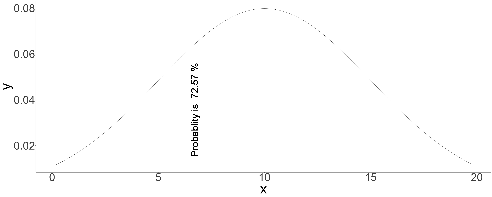

Shiny Application and Reproducible Pitch
========================================================
author: Denis Levert
date: December 29th, 2020
autosize: false
transition: rotate
font-family: 'American Typewriter'

Introduction
========================================================

<font size="6">
* The app was built as a project for course project.<br/>

* I decided to build an app to predict probabilities.<br/>

* I also decided to build the app to produce a normal
distribution graph based on just a mean and standard deviation.<br/>

* I struggled with this in the past and decided it would be a good refresher 
and provide a tool to use again in the future.<br/>

* The link to the app is <http://dlevert.shinyapps.io/myapp><br/>

* The link to the repo is <https://github.com/dlevert/ShinyPitch.git>

</font>

Why Reproducible is better
========================================================

<font size="6">
<br/>
Using tools to share code and results:<br/>

* Ensures others can reproduce the results you produced.<br/>
* Demonstrates the methods on how the research was performed.<br/>
* Builds confidence in your results.<br/>
* Builds confidence in your methods.<br/>
* Builds trust with other.<br/>

</font>

Example
========================================================
<font size="6">


For this example, the mean is 10, the standard deviation is 5, the value to be evaluated is 7



The chances of getting a  7  is  72.57 %.
</font>
Here is the code that was evaluated
========================================================
<font size="5">

```r
     mn <- 10; sd <- 5; val <- 7
     sMin <- qnorm(.025, mean = mn, sd = sd, lower.tail = TRUE)
     sMax <- qnorm(.975, mean = mn, sd = sd, lower.tail = TRUE)
     x <- seq(sMin, sMax, 0.1)
     y <- dnorm(x, mean = mn, sd = sd)
     pred <- pnorm(val, mean = mn, sd = sd, lower.tail = FALSE)
     z <- as.data.frame(x)
     z$y <- y
     txta <- print(paste("For this example, the mean is ", mn, 
                 ", the standard deviation is ", sd,
                 ", the value to be evaluated is ", val, sep = ""))
     txtb <- print(paste("The chances of getting a ", val, " is ", 
                 round(pred * 100, 2), "%."))
     require(ggplot2)
     ggplot(z, aes(x = x, y = y)) +
          geom_line() +
          geom_vline(data = z, mapping = aes(xintercept = val), color = "blue") +
          geom_text(data = z, mapping=aes(x = val, y = 0.015,
                                          label = paste("Probablity is ",
                                                        round(pred * 100, 2),
                                                        "%")), 
                    size = 25, angle = 90, vjust = -0.4, hjust = 0) +
          theme_classic() + theme(text = element_text(size = 100)) 
```
